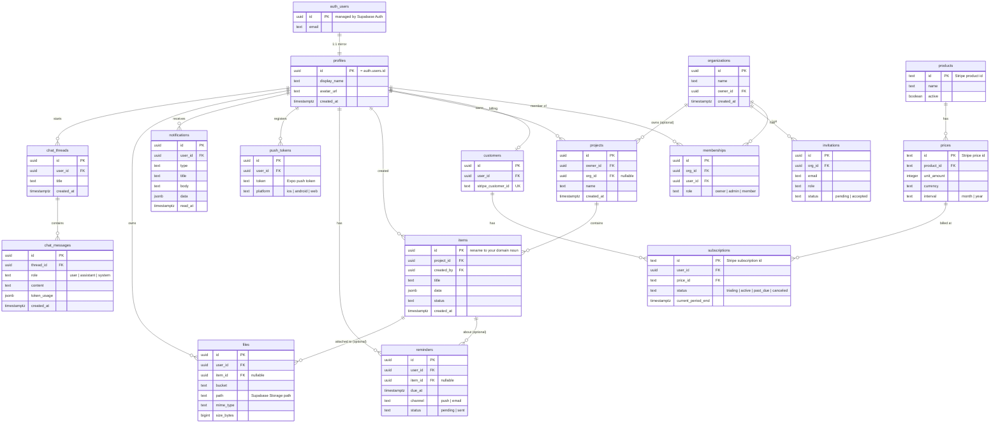

# Meet Dream Starter Kit — Data Model (ERD)

The base schema every cloned app starts from. It's deliberately generic: a universal SaaS substrate
(identity, billing, engagement, files, AI) plus a thin **domain scaffold** (`projects` → `items`) that
you **rename to your idea's nouns** and extend. Built for **Supabase Auth + Row-Level Security** — every
table is owned by a user (directly or via an org), and access is enforced at the database.

> **How to use it:** keep the core (identity + billing), delete the parts your idea doesn't need
> (e.g. drop the org layer for a single-user app, drop chat if there's no AI), and rename
> `projects`/`items` to your domain (see [§ Specializing it per idea](#specializing-it-per-idea)).

---

## Diagram



---

## Tables by group

**Identity & access** *(core — keep)*
- `auth.users` — managed by **Supabase Auth**; you don't create this table.
- `profiles` — app-level user record, 1:1 with `auth.users` (same `id`). Created by a trigger on signup. The anchor for most RLS policies.

**Teams / multi-tenancy** *(optional — drop for single-user apps)*
- `organizations` — a workspace/company.
- `memberships` — the user↔org join with a `role` (drives org-scoped RLS).
- `invitations` — pending invites by email.

**Billing** *(core for any paid app — written by the Stripe webhook)*
- `customers` — maps a user to their `stripe_customer_id` (zero-or-one per user).
- `products`, `prices` — mirrors of your Stripe catalog.
- `subscriptions` — the canonical Stripe subscription state (`status`, `current_period_end`) used to gate premium features on web **and** mobile.

**App domain** *(rename — this is your idea)*
- `projects` — the top-level container the user (or org) owns. Rename to your grouping noun (pipeline, workspace, clinic, store…).
- `items` — the primary domain record. Rename to your core noun (lead, booking, habit, listing, candidate…); `data jsonb` holds idea-specific fields so you can move fast before formalizing columns.

**Engagement** *(most Meet Dream ideas are reminder/nudge engines — keep what fits)*
- `reminders` — scheduled nudges/follow-ups (due time, channel, status); optionally about an `item`.
- `push_tokens` — Expo push tokens per device.
- `notifications` — in-app notification feed with `read_at`.

**Files** *(keep if the app stores uploads)*
- `files` — metadata for objects in **Supabase Storage** (bucket + path + mime + size); optionally attached to an `item`.

**AI assistant** *(keep if the app has AI features)*
- `chat_threads` / `chat_messages` — persisted conversations for the in-app assistant (AI SDK via the Vercel AI Gateway). `token_usage` supports cost/observability.

---

## RLS & ownership model

The rule: **enable RLS on every table**, and write policies so a row is only visible to its owner (a user, or members of its org). Authorization lives in the database, so an app-code bug can't leak another user's data.

```sql
-- Mirror auth.users -> profiles on signup
create trigger on_auth_user_created
  after insert on auth.users
  for each row execute function public.handle_new_user();

-- User-owned table: each user sees/edits only their own rows
alter table items enable row level security;
create policy "items owned by creator"
  on items for all
  to authenticated
  using (created_by = (select auth.uid()))
  with check (created_by = (select auth.uid()));

-- Org-scoped table: the owner, or any member of the row's org
alter table projects enable row level security;
create policy "projects: owner or org member"
  on projects for all
  to authenticated
  using (
    (org_id is null and owner_id = (select auth.uid()))
    or exists (
      select 1 from memberships m
      where m.org_id = projects.org_id
        and m.user_id = (select auth.uid())
    )
  );

-- Stripe-synced tables: users may READ their own; only the webhook writes (service role bypasses RLS)
alter table subscriptions enable row level security;
create policy "read own subscriptions"
  on subscriptions for select
  to authenticated
  using (user_id = (select auth.uid()));
```

Notes:
- Storage buckets get their own RLS policies on `storage.objects` (path-prefixed by user/org), mirroring the `files` table.
- The Stripe webhook (a Supabase edge function) uses the **service role key** to write `customers` / `subscriptions` — clients never write billing rows.
- Wrapping `auth.uid()` as `(select auth.uid())` lets Postgres cache it per statement (a standard Supabase performance tip).

---

## Specializing it per idea

Keep the substrate, rename the domain scaffold, add at most one or two idea-specific tables. Examples drawn from the live catalog:

| Catalog idea | `projects` → | `items` → | Add |
|---|---|---|---|
| Lead follow-up autopilot for body shops | shops | **leads** | reminders = follow-ups |
| Missed-call booking for distilleries | locations | **bookings** | reminders = callbacks |
| Medications / missed-dose tracking | — (per user) | **medications** | `dose_logs` (adherence) |
| Pipeline & reminders for recruiters | **pipelines** | **candidates** | stages on `data` |
| Review & reputation manager for florists | locations | **reviews** | chat_threads = AI reply drafts |
| Savings goals with nudges | — (per user) | **goals** | reminders = nudges |
| Escrow & shipping for antiques (marketplace) | — | **listings** | `orders` + buyer/seller via memberships |

Rules of thumb:
- **Single-user consumer app** → drop `organizations` / `memberships` / `invitations`; own everything by `user_id`.
- **B2B / team SaaS** → keep the org layer; scope `projects`/`items` by `org_id`.
- **Marketplace** → add a transactions/`orders` table and model the two sides with `memberships` roles (buyer/seller); RLS lets each side see only their own orders.
- **No AI** → drop `chat_threads` / `chat_messages`. **No uploads** → drop `files`. **No reminders** → drop `reminders` / `push_tokens`.

This base lives in `supabase/migrations/` (schema + the RLS policies above) and seeds demo rows in `supabase/seed.sql`.
