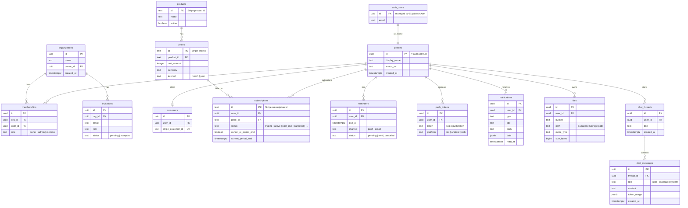

# Dream Starter Kit — Data Model (ERD)

The base schema every cloned app starts from. It's deliberately generic: a universal SaaS substrate
(identity, billing, engagement, files, AI) that you extend with your product's tables. Built for
**Supabase Auth + Row-Level Security** — every table is owned by a user (directly or via an org), and
access is enforced at the database.

> The SQL in `supabase/migrations/` is the source of truth for exact columns and
> constraints; this document is the readable overview.

> **How to use it:** keep the core (identity + billing), delete the parts your idea doesn't need
> (e.g. drop the org layer for a single-user app, drop chat if there's no AI), and add your own
> per-user tables following the canonical RLS pattern below (see
> [§ Specializing it per idea](#specializing-it-per-idea)).

> **Editorial vs. app data.** This ERD covers **per-user app data** in Supabase's `public` schema
> under RLS. **Editorial / marketing content** (articles, events, pages, …) lives in a separate
> `cms` Postgres schema owned by **Payload CMS** — that schema is provisioned and migrated by Payload,
> sits **outside** Supabase RLS by design (access is enforced by Payload's own access-control), and is
> **not** modeled here. See [`ARCHITECTURE.md` → Content (Payload CMS)](./ARCHITECTURE.md#4x-content--payload-cms).

---

## Diagram



---

## Tables by group

**Identity & access** *(core — keep)*
- `auth.users` — managed by **Supabase Auth**; you don't create this table.
- `profiles` — app-level user record, 1:1 with `auth.users` (same `id`). Created by a trigger on signup. The anchor for most RLS policies.

**Teams / multi-tenancy** *(optional — drop for single-user apps)*
- `organizations` — a workspace/company.
- `memberships` — the user↔org join with a `role` (drives org-scoped RLS).
- `invitations` — pending invites by email.

**Billing** *(core for any paid app — written by the Stripe webhook)*
- `customers` — maps a user to their `stripe_customer_id` (zero-or-one per user).
- `products`, `prices` — mirrors of your Stripe catalog.
- `subscriptions` — the canonical Stripe subscription state (`status`, `current_period_end`) used to gate premium features on web **and** mobile.

**App domain** *(this is your idea — add it)*
- The kit ships **no** example domain table; you add your own per-user tables (the primary records of your product) following the canonical RLS pattern below. Use `data jsonb` on a table if you want idea-specific fields before formalizing columns.

**Engagement** *(many apps are reminder/nudge engines — keep what fits)*
- `reminders` — scheduled nudges/follow-ups (due time, channel, status).
- `push_tokens` — Expo push tokens per device.
- `notifications` — in-app notification feed with `read_at`.

**Files** *(keep if the app stores uploads)*
- `files` — metadata for objects in **Supabase Storage** (bucket + path + mime + size), in the RLS-governed `user-files` bucket.

**AI assistant** *(keep if the app has AI features)*
- `chat_threads` / `chat_messages` — persisted conversations for the in-app assistant (AI SDK via the Vercel AI Gateway). `token_usage` supports cost/observability.

**Content** *(Payload CMS — outside this ERD)*
- Editorial/marketing content (`articles`, `events`, `videos`, `audio`, `photos`, `locations`, `pages`, plus `media` uploads and Payload's own `users`) lives in the separate **`cms`** Postgres schema, owned and migrated by **Payload CMS**. It is intentionally **outside Supabase RLS** — Payload enforces its own access-control (e.g. published-or-admin) and connects as a dedicated least-privilege `payload_cms` role scoped to `cms` only. Don't model it here or add it to the RLS tests.

---

## RLS & ownership model

The rule: **enable RLS on every table**, and write policies so a row is only visible to its owner (a user, or members of its org). Authorization lives in the database, so an app-code bug can't leak another user's data.

```sql
-- Mirror auth.users -> profiles on signup
create trigger on_auth_user_created
  after insert on auth.users
  for each row execute function public.handle_new_user();

-- User-owned table (the canonical pattern): each user sees/edits only their own rows.
-- `reminders` is the simplest live example — copy this for any per-user table you add.
alter table reminders enable row level security;
create policy "reminders owned by user"
  on reminders for all
  to authenticated
  using (user_id = (select auth.uid()))
  with check (user_id = (select auth.uid()));

-- Org-scoped variant: the owner, or any member of the row's org. Use this shape
-- for a table with a nullable `org_id` (model it on `organizations`/`memberships`).
-- create policy "<table>: owner or org member"
--   on <table> for all
--   to authenticated
--   using (
--     (org_id is null and owner_id = (select auth.uid()))
--     or exists (
--       select 1 from memberships m
--       where m.org_id = <table>.org_id
--         and m.user_id = (select auth.uid())
--     )
--   );

-- Stripe-synced tables: users may READ their own; only the webhook writes (service role bypasses RLS)
alter table subscriptions enable row level security;
create policy "read own subscriptions"
  on subscriptions for select
  to authenticated
  using (user_id = (select auth.uid()));
```

Notes:
- Storage buckets get their own RLS policies on `storage.objects` (path-prefixed by user/org), mirroring the `files` table.
- The Stripe webhook (a Supabase edge function) uses the **service role key** to write `customers` / `subscriptions` — clients never write billing rows.
- Wrapping `auth.uid()` as `(select auth.uid())` lets Postgres cache it per statement (a standard Supabase performance tip).

---

## Specializing it per idea

Keep the substrate and add your own idea-specific tables. The first question is **whose data is it?**

- **Per-user app data** (a user's own records — leads, bookings, medications, candidates, goals, listings,
  …) → a new table in the `public` schema, owned by `user_id` (or scoped via `org_id`), with the canonical
  RLS policy and an FK index. Use `data jsonb` for fields you haven't formalized yet. Add one via the
  recipe in [`CLAUDE.md`](../CLAUDE.md#worked-example).
- **Editorial / marketing content** (articles, events, pages, media — the same for every visitor) → a
  **Payload collection**, not a Supabase table. It lands in the `cms` schema, outside RLS, served on public
  pages and to mobile over REST. Add one via [`CLAUDE.md` → How to add a Payload content type](../CLAUDE.md#how-to-add-a-payload-content-type).

Rules of thumb for the Supabase side:
- **Single-user consumer app** → drop `organizations` / `memberships` / `invitations`; own everything by `user_id`.
- **B2B / team SaaS** → keep the org layer; scope your tables by `org_id` (org-scoped policy above).
- **Marketplace** → add a transactions/`orders` table and model the two sides with `memberships` roles (buyer/seller); RLS lets each side see only their own orders.
- **No AI** → drop `chat_threads` / `chat_messages`. **No uploads** → drop `files`. **No reminders** → drop `reminders` / `push_tokens`.

This base lives in `supabase/migrations/` (schema + the RLS policies above) and seeds demo rows in `supabase/seed.sql`.
